# Nexus Sync: Decouple Your Teams

**Language:** Java | **Prereqs:** Temporal workflows & activities

---

## Scenario

<p align="center">
  
</p>

## Quickstart Docs By Temporal

:rocket: [Get started in a few mins](https://docs.temporal.io/quickstarts?utm_campaign=awareness-nikolay-advolodkin&utm_medium=code&utm_source=github)

---

## Overview

<p align="center">
  
</p>

> **Interactive version:** Open [`ui/nexus-decouple.html`](ui/nexus-decouple.html) in your browser to toggle between Monolith and Nexus modes with animated data flow.

---

## Checkpoint 0: Run the Monolith

Before changing anything, let's see the system working. You need **3 terminal windows** and a running Temporal server.

**Terminal 0 — Temporal Server** (if not already running):
```bash
temporal server start-dev
```

**Terminal 1 — Start the monolith worker:**
```bash
cd exercise
mvn compile exec:java@payments-worker
```

You should see:
```log
Payments Worker started on: payments-processing
Registered: PaymentProcessingWorkflow, PaymentActivity
            ComplianceActivity (monolith — will decouple)
```

**Terminal 2 — Run the starter:**
```bash
cd exercise
mvn compile exec:java@starter
```

**Expected results:**

<table>
<tr>
<th>Transaction</th>
<th>Amount</th>
<th>Route</th>
<th>Risk</th>
<th>Result</th>
</tr>
<tr>
<td><code>TXN-A</code></td>
<td>$250</td>
<td>US &#x2192; US</td>
<td>&#x1F7E2; LOW</td>
<td>&#x2705; <code>COMPLETED</code></td>
</tr>
<tr>
<td><code>TXN-B</code></td>
<td>$12,000</td>
<td>US &#x2192; UK</td>
<td>&#x1F7E0; MEDIUM</td>
<td>&#x2705; <code>COMPLETED</code></td>
</tr>
<tr>
<td><code>TXN-C</code></td>
<td>$75,000</td>
<td>US &#x2192; North Korea</td>
<td>&#x1F534; HIGH</td>
<td>&#x1F6AB; <code>DECLINED_COMPLIANCE</code></td>
</tr>
</table>

:white_check_mark: **Checkpoint 0 passed** if all 3 transactions complete with the expected results. The system works! Now let's decouple it.

> **Stop the worker** (Ctrl+C in Terminal 1) before continuing.

---

## The 7 TODOs

<table>
<tr>
<th>#</th>
<th>File</th>
<th>Action</th>
<th>Key Concept</th>
</tr>
<tr>
<td><strong>1</strong></td>
<td><code>shared/nexus/ComplianceNexusService.java</code></td>
<td>&#x1F7E2; Create</td>
<td><code>@Service</code> + <code>@Operation</code> interface</td>
</tr>
<tr>
<td><strong>2</strong></td>
<td><code>compliance/temporal/workflow/ComplianceWorkflow.java</code></td>
<td>&#x1F7E2; Create</td>
<td><code>@WorkflowInterface</code> + <code>@SignalMethod</code></td>
</tr>
<tr>
<td><strong>3</strong></td>
<td><code>compliance/temporal/workflow/ComplianceWorkflowImpl.java</code></td>
<td>&#x1F7E2; Create</td>
<td><code>Workflow.await()</code> + activity call</td>
</tr>
<tr>
<td><strong>4</strong></td>
<td><code>compliance/temporal/ComplianceNexusServiceImpl.java</code></td>
<td>&#x1F7E2; Create</td>
<td>Sync handler with signal-with-start</td>
</tr>
<tr>
<td><strong>5</strong></td>
<td><code>compliance/temporal/ComplianceWorkerApp.java</code></td>
<td>&#x1F7E2; Create</td>
<td>Register workflow + activity + Nexus handler</td>
</tr>
<tr>
<td><strong>6</strong></td>
<td><code>payments/temporal/PaymentProcessingWorkflowImpl.java</code></td>
<td>&#x1F7E1; Modify</td>
<td>Replace activity stub &#x2192; Nexus stub</td>
</tr>
<tr>
<td><strong>7</strong></td>
<td><code>payments/temporal/PaymentsWorkerApp.java</code></td>
<td>&#x1F7E1; Modify</td>
<td>Add <code>NexusServiceOptions</code>, remove <code>ComplianceActivity</code></td>
</tr>
</table>

**Teaching order:** what you're building (1-3) → how the handler connects them (4) → how you expose it (5, CLI) → how the caller uses it (6-7).

---

## TODO 1: Create the Nexus Service Interface

**File:** `shared/nexus/ComplianceNexusService.java`

This is the **shared contract** between teams — like an OpenAPI spec, but durable. Both teams depend on this interface.

**What to add:**
1. `@Service` annotation on the interface (from `io.nexusrpc`)
2. One method: `checkCompliance(ComplianceRequest) → ComplianceResult`
3. `@Operation` annotation on that method

**Pattern to follow:**
```java
@Service
public interface ComplianceNexusService {
    @Operation
    ComplianceResult checkCompliance(ComplianceRequest request);
}
```

> **Tip:** The `@Service` and `@Operation` annotations come from `io.nexusrpc`, NOT from `io.temporal`. Nexus is a protocol — Temporal implements it, but the interface annotations are protocol-level.

---

## TODO 2: Define the ComplianceWorkflow Interface

**File:** `compliance/temporal/workflow/ComplianceWorkflow.java`

This workflow wraps the compliance check activity. The Nexus handler will use **signal-with-start** to launch it and deliver the request in a single atomic operation.

**What to add:**
1. `@WorkflowInterface` annotation on the interface
2. `@WorkflowMethod`: `ComplianceResult run()`
3. `@SignalMethod`: `void submitRequest(ComplianceRequest request)`

**Pattern to follow:**
```java
@WorkflowInterface
public interface ComplianceWorkflow {
    @WorkflowMethod
    ComplianceResult run();

    @SignalMethod
    void submitRequest(ComplianceRequest request);
}
```

> **Why signal-with-start?** The Nexus handler needs to both start the workflow AND deliver the request. Signal-with-start does this atomically — no race condition between starting the workflow and sending the data.

---

## TODO 3: Implement the ComplianceWorkflow

**File:** `compliance/temporal/workflow/ComplianceWorkflowImpl.java`

This workflow waits for a signal, then runs the compliance check as an activity.

**What to implement:**
1. A `pendingRequest` field (starts as `null`)
2. An activity stub for `ComplianceActivity`
3. `run()`: Use `Workflow.await(() -> pendingRequest != null)`, then call the activity
4. `submitRequest()`: Set `pendingRequest = request`

**Pattern to follow:**
```java
public class ComplianceWorkflowImpl implements ComplianceWorkflow {
    private ComplianceRequest pendingRequest = null;

    private final ComplianceActivity complianceActivity = Workflow.newActivityStub(
            ComplianceActivity.class,
            ActivityOptions.newBuilder()
                    .setStartToCloseTimeout(Duration.ofSeconds(30))
                    .build());

    @Override
    public ComplianceResult run() {
        Workflow.await(() -> pendingRequest != null);
        return complianceActivity.checkCompliance(pendingRequest);
    }

    @Override
    public void submitRequest(ComplianceRequest request) {
        this.pendingRequest = request;
    }
}
```

> **Key pattern:** `Workflow.await(() -> pendingRequest != null)` blocks the workflow until the signal arrives. It's durable — if the worker restarts, the workflow replays and waits again.

---

## TODO 4: Implement the Nexus Handler

**File:** `compliance/temporal/ComplianceNexusServiceImpl.java`

This is the handler that receives Nexus requests from Payments. Instead of running business logic directly, it uses **signal-with-start** to launch the ComplianceWorkflow.

**Two new annotations:**
- `@ServiceImpl(service = ComplianceNexusService.class)` — on the class
- `@OperationImpl` — on each handler method

**What to implement:**
1. Add `@ServiceImpl` annotation pointing to the interface
2. Create `checkCompliance()` method returning `OperationHandler<ComplianceRequest, ComplianceResult>`
3. Inside: return `WorkflowClientOperationHandlers.sync(...)` with signal-with-start

**Pattern to follow:**
```java
@ServiceImpl(service = ComplianceNexusService.class)
public class ComplianceNexusServiceImpl {

    @OperationImpl
    public OperationHandler<ComplianceRequest, ComplianceResult> checkCompliance() {
        return WorkflowClientOperationHandlers.sync((ctx, details, client, input) -> {
            ComplianceWorkflow wf = client.newWorkflowStub(
                    ComplianceWorkflow.class,
                    WorkflowOptions.newBuilder()
                            .setTaskQueue("compliance-risk")
                            .setWorkflowId("compliance-" + input.getTransactionId())
                            .build());

            BatchRequest batch = client.newSignalWithStartRequest();
            batch.add(wf::run);
            batch.add(wf::submitRequest, input);
            client.signalWithStart(batch);

            return WorkflowStub.fromTyped(wf).getResult(ComplianceResult.class);
        });
    }
}
```

> **Key insight:** Sync handlers should only contain **Temporal primitives** (workflow starts, signals, queries) — not arbitrary business logic. The actual compliance check runs inside ComplianceWorkflow's activity.

> **Common trap:** Don't write `class ComplianceNexusServiceImpl implements ComplianceNexusService`. The handler does **not** implement the interface — the signatures are completely different. The interface method returns `ComplianceResult`, but the handler method returns `OperationHandler<ComplianceRequest, ComplianceResult>`. The link between them is the `@ServiceImpl` annotation, not Java's `implements`.

### Quick Check

**Q1:** What does `@ServiceImpl(service = ComplianceNexusService.class)` tell Temporal?

- A) This class is a Temporal workflow
- B) This class handles Nexus requests for the `ComplianceNexusService` interface
- C) This class registers a new activity type
- D) This class creates a Nexus endpoint

<details>
<summary>Answer</summary>

**B.** `@ServiceImpl` links the handler class to its Nexus service interface. Temporal uses this to route incoming Nexus operations to the correct handler.

</details>

**Q2:** Why does the sync handler use signal-with-start instead of calling `ComplianceChecker` directly?

- A) Signal-with-start is faster than direct method calls
- B) Sync handlers should only contain Temporal primitives — business logic belongs in activities within workflows
- C) `ComplianceChecker` can't be serialized
- D) Direct calls aren't supported in sync handlers

<details>
<summary>Answer</summary>

**B.** Sync handlers run inside the Nexus request processing path. They should only use Temporal primitives (workflow starts, signals, queries). Business logic belongs in activities, which are invoked by workflows. This keeps the handler thin and the architecture consistent.

</details>

---

## TODO 5: Create the Compliance Worker

**File:** `compliance/temporal/ComplianceWorkerApp.java`

Standard **CRAWL** pattern, but now with **three registrations**:

```text
C — Connect to Temporal
R — Create factory and worker on "compliance-risk"
W — Wire:
    1. worker.registerWorkflowImplementationTypes(ComplianceWorkflowImpl.class)
    2. worker.registerActivitiesImplementations(new ComplianceActivityImpl(new ComplianceChecker()))
    3. worker.registerNexusServiceImplementation(new ComplianceNexusServiceImpl())
L — Launch
```

Compare to what you already know:
```java
// Workflows (you've done this before):
worker.registerWorkflowImplementationTypes(...)

// Activities (you've done this before):
worker.registerActivitiesImplementations(...)

// Nexus (new — same shape, different method name):
worker.registerNexusServiceImplementation(...)
```

**Task queue:** `"compliance-risk"` — must match the `--target-task-queue` from the CLI endpoint creation.

---

## Checkpoint 1: Compliance Worker Starts

```bash
cd exercise
mvn compile exec:java@compliance-worker
```

:white_check_mark: **Checkpoint 1 passed** if you see:
```log
Compliance Worker started on: compliance-risk
```

If it fails to compile, check:
- TODO 1: Does `ComplianceNexusService` have `@Service` and `@Operation`?
- TODO 2: Does `ComplianceWorkflow` have `@WorkflowInterface`, `@WorkflowMethod`, and `@SignalMethod`?
- TODO 3: Does `ComplianceWorkflowImpl` use `Workflow.await()` and call the activity?
- TODO 4: Does `ComplianceNexusServiceImpl` have `@ServiceImpl` and `@OperationImpl`?
- TODO 5: Are you registering the workflow, activity, and Nexus service?

> **Keep the compliance worker running** — you'll need it for Checkpoint 2.

---

## Checkpoint 1.5: Create the Nexus Endpoint

Now that the compliance side is built, register the Nexus endpoint with Temporal. This tells Temporal: *"When someone calls `compliance-endpoint`, route it to the `compliance-risk` task queue."*

```bash
temporal operator nexus endpoint create \
  --name compliance-endpoint \
  --target-namespace default \
  --target-task-queue compliance-risk
```

You should see:
```log
Endpoint compliance-endpoint created.
```

> **Analogy:** This is like adding a contact to your phone. The endpoint name is the contact name; the task queue is the phone number. You only do this once.

---

## TODO 6: Replace Activity Stub with Nexus Stub

**File:** `payments/temporal/PaymentProcessingWorkflowImpl.java`

This is the **key teaching moment**. You're swapping one line of code that changes the entire architecture.

**BEFORE:**
```java
private final ComplianceActivity complianceActivity =
    Workflow.newActivityStub(ComplianceActivity.class, ACTIVITY_OPTIONS);

// In processPayment():
ComplianceResult compliance = complianceActivity.checkCompliance(compReq);
```

**AFTER:**
```java
private final ComplianceNexusService complianceService = Workflow.newNexusServiceStub(
    ComplianceNexusService.class,
    NexusServiceOptions.newBuilder()
        .setOperationOptions(NexusOperationOptions.newBuilder()
            .setScheduleToCloseTimeout(Duration.ofMinutes(10))
            .build())
        .build());

// In processPayment():
ComplianceResult compliance = complianceService.checkCompliance(compReq);
```

**What changed:**

<table>
<tr>
<th>&#x1F534; Before (Monolith)</th>
<th>&#x1F7E2; After (Nexus)</th>
</tr>
<tr>
<td><code>Workflow.newActivityStub()</code></td>
<td><code>Workflow.newNexusServiceStub()</code></td>
</tr>
<tr>
<td><code>ComplianceActivity.class</code></td>
<td><code>ComplianceNexusService.class</code></td>
</tr>
<tr>
<td><code>ActivityOptions</code></td>
<td><code>NexusServiceOptions</code> + <code>scheduleToCloseTimeout</code></td>
</tr>
<tr>
<td><code>complianceActivity.</code></td>
<td><code>complianceService.</code></td>
</tr>
</table>

**What stayed the same:**
- `.checkCompliance(compReq)` — identical call
- `ComplianceResult` — same return type
- All surrounding logic — untouched

> **Where does the endpoint come from?** Not here! The workflow only knows the **service** (`ComplianceNexusService`). The **endpoint** (`"compliance-endpoint"`) is configured in the worker (TODO 7). This keeps the workflow portable.

---

## TODO 7: Update the Payments Worker

**File:** `payments/temporal/PaymentsWorkerApp.java`

Two changes:

**CHANGE 1:** Register the workflow with `NexusServiceOptions`:
```java
worker.registerWorkflowImplementationTypes(
    WorkflowImplementationOptions.newBuilder()
        .setNexusServiceOptions(Collections.singletonMap(
            "ComplianceNexusService",      // interface name (no package)
            NexusServiceOptions.newBuilder()
                .setEndpoint("compliance-endpoint")  // matches CLI endpoint
                .build()))
        .build(),
    PaymentProcessingWorkflowImpl.class);
```

**CHANGE 2:** Remove `ComplianceActivityImpl` registration:
```java
// DELETE these lines:
ComplianceChecker checker = new ComplianceChecker();
worker.registerActivitiesImplementations(new ComplianceActivityImpl(checker));
```

> **Analogy:** You're removing the compliance department from your building and adding a phone extension to their new office. The workflow dials the same number (`checkCompliance`), but the call now routes across the street.

---

## Checkpoint 2: Full Decoupled End-to-End

You need **4 terminal windows** now:

**Terminal 0:** Temporal server (already running)

**Terminal 1 — Compliance worker** (already running from Checkpoint 1, or restart):
```bash
cd exercise
mvn compile exec:java@compliance-worker
```

**Terminal 2 — Payments worker** (restart with your changes):
```bash
cd exercise
mvn compile exec:java@payments-worker
```

**Terminal 3 — Starter:**
```bash
cd exercise
mvn compile exec:java@starter
```

:white_check_mark: **Checkpoint 2 passed** if you get the **exact same results** as Checkpoint 0:

<table>
<tr>
<th>Transaction</th>
<th>Risk</th>
<th>Result</th>
</tr>
<tr>
<td><code>TXN-A</code></td>
<td>&#x1F7E2; LOW</td>
<td>&#x2705; <code>COMPLETED</code></td>
</tr>
<tr>
<td><code>TXN-B</code></td>
<td>&#x1F7E0; MEDIUM</td>
<td>&#x2705; <code>COMPLETED</code></td>
</tr>
<tr>
<td><code>TXN-C</code></td>
<td>&#x1F534; HIGH</td>
<td>&#x1F6AB; <code>DECLINED_COMPLIANCE</code></td>
</tr>
</table>

Same results, completely different architecture. Two workers, two blast radii, two independent teams.

> **Check the Temporal UI** at http://localhost:8233 — you should see Nexus operations in the workflow event history!

---

## Victory Lap: Durability Across the Boundary

This is where it gets fun. Let's prove that Nexus is **durable** — not just a fancy RPC.

1. **Start both workers** (if not already running)
2. **Run the starter** in another terminal
3. **While TXN-B is processing**, kill the compliance worker (Ctrl+C in Terminal 1)
4. Watch the payment workflow **pause** — it's waiting for the Nexus operation to complete
5. **Restart the compliance worker**
6. Watch the payment workflow **resume and complete**

The payment workflow didn't crash. It didn't timeout. It didn't lose data. It just... waited. Because Temporal + Nexus handles this automatically.

> **Try this with REST:** Kill the compliance service mid-request. What happens? Connection reset. Transaction lost. 3am page. With Nexus, the workflow simply picks up where it left off.

---

## Bonus Exercise: What Happens When You Wait Too Long?

You saw the workflow **wait** for the compliance worker to come back. But what if it never comes back?

**Try this:**

1. Start both workers and the starter
2. Kill the compliance worker while a transaction is processing
3. **Don't restart it.** Wait and watch the Temporal UI at http://localhost:8233

**Question:** What eventually happens to the payment workflow?

<details>
<summary>Answer</summary>

The Nexus operation fails with a `SCHEDULE_TO_CLOSE` timeout after 10 minutes. The workflow's `catch` block handles it — the payment gets status `FAILED` instead of hanging forever.

This is the `scheduleToCloseTimeout` you set in TODO 6:

```java
NexusOperationOptions.newBuilder()
    .setScheduleToCloseTimeout(Duration.ofMinutes(10))
```

**The lesson:** Nexus gives you durability, not infinite patience. You control how long the workflow is willing to wait. In production, you'd set this based on your SLA — maybe 30 seconds for a real-time payment, or 24 hours for a batch compliance review.

</details>

---

## Quiz

Test your understanding before moving on:

**Q1:** Where is the Nexus endpoint name (`"compliance-endpoint"`) configured?

<details>
<summary>Answer</summary>

In `PaymentsWorkerApp`, via `NexusServiceOptions` → `setEndpoint("compliance-endpoint")`. The **workflow** only knows the service interface. The **worker** knows the endpoint. This separation keeps the workflow portable.

</details>

**Q2:** What happens if the Compliance worker is down when the Payments workflow calls `checkCompliance()`?

<details>
<summary>Answer</summary>

The Nexus operation will be retried by Temporal until the `scheduleToCloseTimeout` expires (10 minutes in our case). If the Compliance worker comes back within that window, the operation completes successfully. The Payment workflow just waits — no crash, no data loss.

</details>

**Q3:** What's the difference between `@Service/@Operation` and `@ServiceImpl/@OperationImpl`?

<details>
<summary>Answer</summary>

- `@Service` / `@Operation` (from `io.nexusrpc`) go on the **interface** — the shared contract both teams depend on
- `@ServiceImpl` / `@OperationImpl` (from `io.nexusrpc.handler`) go on the **handler class** — the implementation that only the Compliance team owns

Think of it as: the interface is the **menu** (shared), the handler is the **kitchen** (private).

</details>

**Q4:** Why does the sync handler use signal-with-start instead of calling `ComplianceChecker.checkCompliance()` directly?

<details>
<summary>Answer</summary>

Sync handlers should only contain **Temporal primitives** — workflow starts, signals, and queries. Running arbitrary Java code (like `ComplianceChecker.checkCompliance()`) in a handler bypasses Temporal's durability guarantees.

By using signal-with-start, the handler:
1. Starts a workflow (durable)
2. Signals it with the request (durable)
3. Waits for the result

The actual business logic runs inside an activity within the workflow, where it gets retries, timeouts, and heartbeats for free.

</details>

---

## What's Next?

You've just learned the fundamental Nexus pattern: **same method call, different architecture**.

From here you can explore **async Nexus handlers** using `fromWorkflowMethod()` — where the Compliance side starts a full Temporal workflow instead of running inline. That's where Nexus truly shines: long-running, durable operations across team boundaries. See the [Nexus documentation](https://docs.temporal.io/nexus) to go deeper.

---

*Nexus Sync: Decouple Your Teams*
*Part of [edu-nexus-code](https://github.com/temporalio/edu-nexus-code)*
